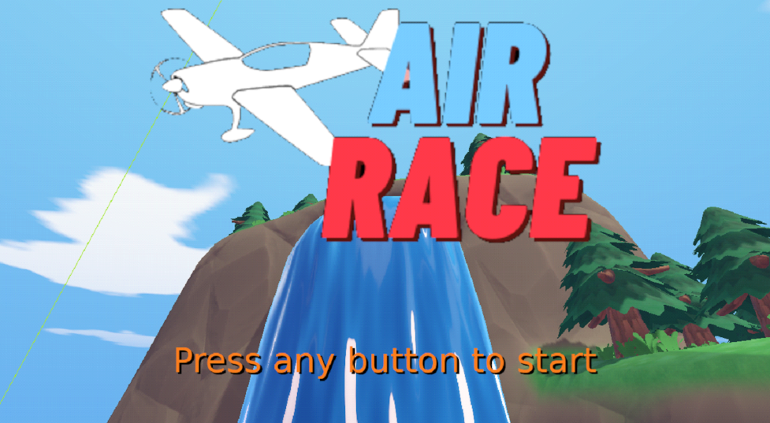
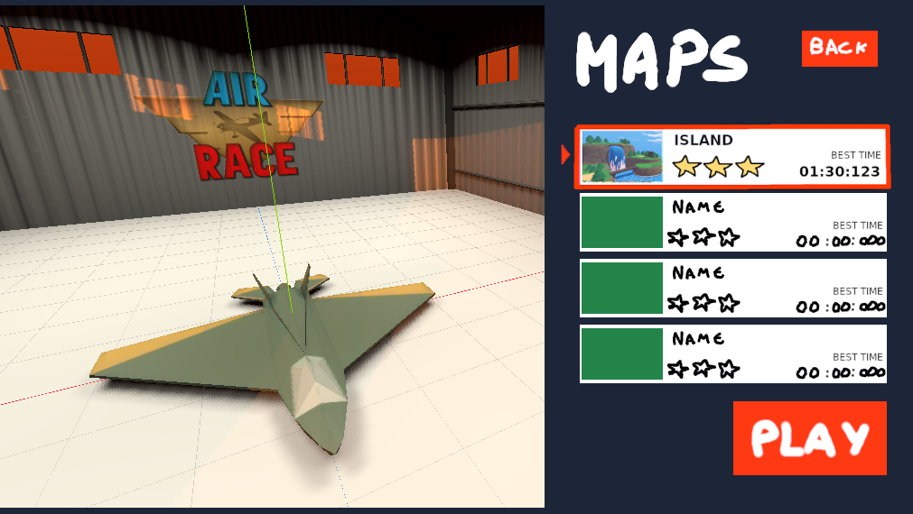

# AirRace Design

## Gameplay

### Race rules
Fly a plane, racing against time in a circuit of gates/checkpoints.
The circuit might have some obstacles to make passing by the gates more difficult and more fun. If the player hits an obstacle, he respawns back in the last passed gate.
Starts with a countdown

### Aircraft movement
The player can control the plane’s 3 rotation axis (Yaw, Pitch, Roll) using the keyboard or game controller. 2 button composite (input axis) used for each rotation axis (6 possible inputs). Acceleration is constant.
The game is arcade, and the “physics” unrealistic. The movement should not use forces, but just use linear velocities instead. To somewhat simulate how forces interpolate naturally overtime, the target linear velocities are calculated and the current velocities are interpolated with an arbitrary factor, allowing to adjust how static of drifty the movement feels. To simplify gravity and lift, a downwards velocity is applied when the plane is not flying completely horizontally (non-default position?), so climbing is slower, falling is faster, and rolling causing decrease in altitude.

## HUD
HUD shows percentage and time on corner.
Percentage is the completion progress of the circuit, how many gates the player passed through.
The time is a chronometer, and when the player passes a gate, it also shows what was the time difference against the gate’s top time (time stamps should be saved for each gate for this purpose) in green if less, or red if more. In case the player beats the final best time, his timestamps should be saved along with the new best time.
The best time is shown in a smaller and greyed out below the chronometer
A distance meter to the next gate always hovers the screen position of the next gate. If the gate is out of the screen, then the meter should stick to the screen border, closest to the gate.

## Results
When the player crossed the last gate, the HUD fades away and a dark overlay fades in quickly. The elements of the results panel start fading in one at a time, with the buttons being last. On the left side, a hover camera can be showing the map in the background.

## Main Menu

Smooth transition when key pressed. Similar to Rocket League

## Play Menu
Similar to rocket league, where the background is the car in the arena, in this case the plane on the map.
One of the options is to press a button, like C or (Y), to open plane customization, so the plane costumization is a sub panel of the Play Menu OR use preset planes that the player can scroll through.

## Notes
UI Ideas from [“You suck at parking”](https://www.gameuidatabase.com/gameData.php?id=1554)

# Technical Design

## UI interaction flow

